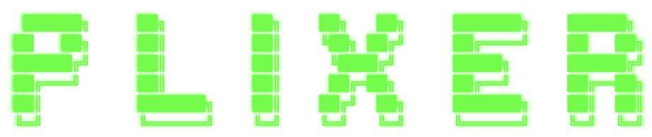
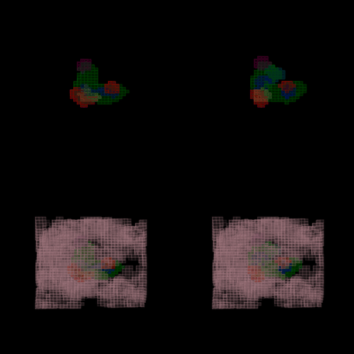

Plixer is a generative model for drug-like molecules that bind in protein pockets.
Provide a PDB file and a pocket location and the model generates SMILES strings for small molecule binders.



## Installation

1.  **Clone the repository:**
    ```bash
    git clone git@github.com:JudeWells/plixer.git
    cd plixer
    ```

2.  **Install dependencies:**
    It is recommended to use a virtual environment. Plixer was developed and tested using python 3.11 
    ```bash
    python3.11 -m venv venvPlixer
    source venvPlixer/bin/activate
    pip install -r requirements.txt
    ```
    or
    ```
    pip install -r requirements_no_gpu.txt
    ```

3.  **Download Model Checkpoints:**
    The necessary model checkpoints are hosted on Hugging Face Hub. Run the following script to download them into the `checkpoints/` directory.
    ```bash
    python download_checkpoints.py
    ```

4. **Check instalation by running**
```
python inference/generate_smiles_from_pdb.py
```

This repository contains three models:

1. **Poc2Mol**: Generates voxelized ligands from protein voxel inputs
2. **Vox2Smiles**: Decodes voxelized ligands into SMILES strings
3. **CombinedProtein2Smiles** combines 1 & 2 for end-to-end pipeline

## Project Structure

```
├── configs/                  # Configuration files
│   ├── data/                 # Data configuration
│   ├── model/                # Model configuration
│   └── experiments/          # Launch training runs with this
├── src/                      # Source code
│   ├── data/                 # Data processing modules
│   │   ├── common/           # Common data utilities
│   │   │   ├── tokenizers/   # SMILES tokenizers
│   │   │   └── voxelization/ # Unified voxelization code
│   │   ├── poc2mol/          # Poc2Mol data modules
│   │   ├── vox2smiles/       # Vox2Smiles data modules
│   │   └── poc2smiles/       # Combined data modules
│   ├── models/               # Model definitions
│   └── utils/                # Utility functions
└── scripts/                  # Random scripts
```


## Usage

### Generating novel molecules for a PDB

To see the configurable options for inference run:
```
python inference/generate_smiles_from_pdb.py --help
```

### Training poc2mol
The original model was trained using bfloat16.
If you want to replicate this modify this file in your dock2grid install (optional):
`venvPlixer/lib/python3.11/site-packages/docktgrid/config.py`
```python
DTYPE = torch.bfloat16
```
```bash
python src/train.py experiment=example_train_poc2mol_plinder
```

### Training vox2smiles on zinc molecules

```bash
python src/train.py experiment=example_train_vox2smiles_zinc

```

### Fine-tuning Vox2Smiles on Poc2Mol Outputs AND zinc

```bash
python src/train.py experiment=train_vox2smiles_combined
```

## Model Architecture

### Poc2Mol

The Poc2Mol model is a 3D U-Net that takes protein voxels as input and generates ligand voxels as output.

### Vox2Smiles

The Vox2Smiles model is a Vision Transformer (ViT) that takes ligand voxels as input and generates SMILES strings as output. It uses a transformer encoder to process the voxel patches and a GPT-style decoder to generate the SMILES tokens.

### Combined Model

The combined CombinedProtein2Smiles model connects the Poc2Mol and Vox2Smiles models in an end-to-end fashion. It takes protein voxels as input, generates ligand voxels using Poc2Mol, and then generates SMILES strings using Vox2Smiles.

## License

This project is licensed under the MIT License - see the LICENSE file for details.

## Acknowledgements

- The voxelization code is based on [DockTGrid](https://github.com/example/docktgrid). 